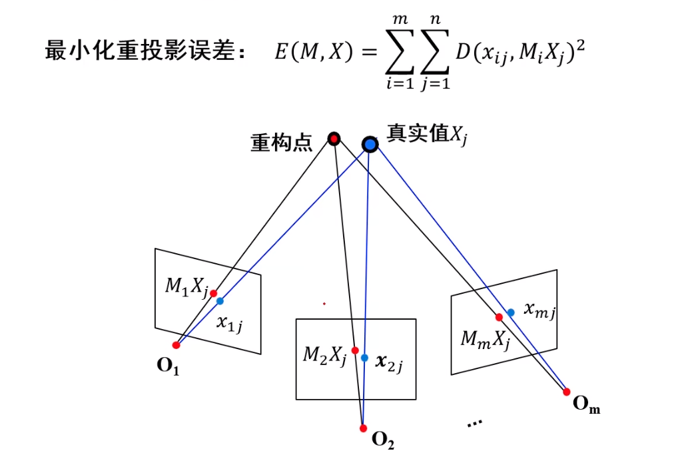

# 捆绑调整

捆绑调整的目的是通过重构的点计算重投影误差，利用最优化方法是重投影误差最小。这是一个典型的非线性最小二乘问题，利用高斯-牛顿法进行优化（高斯-牛顿法原理参考https://blog.csdn.net/holle_world_ldx/article/details/138225785）

# 求雅可比矩阵

## 一、相机投影过程

### 1、世界坐标系到相机坐标系的变换

$$
\begin{bmatrix}
 x_c\\
 y_c\\
z_c
\end{bmatrix}=RX+t=\begin{bmatrix}r_0 & r_1 &r_2 \\ r_3 & r_4 & r_5 \\ r_6 &r_7 &r_8 \end{bmatrix} \begin{bmatrix}X\\Y\\Z \end{bmatrix}+\begin{bmatrix}t_0\\t_1\\t_2\end{bmatrix}
$$

### 2、归一化像平面

$$
\begin{aligned}
&x_c = r_0X +r_1Y+r_2Z +t_0  \\
&y_c = r_3X +r_4Y+r_5Z +t_1  \\
&z_c = r_6X +r_7Y+r_8Z +t_2  \\
&\begin{bmatrix}x\\y\end{bmatrix}=\begin{bmatrix} \frac{x_c}{z_c}\\\frac{y_c}{z_c}\end{bmatrix}
\end{aligned}
$$

#### 3、相机成像平面

$$
\begin{bmatrix}u\\v\end{bmatrix}=\begin{bmatrix} fd(k_0,k_1,r^2)x \\fd(k_0,k_1,r^2)y\end{bmatrix}, \ d(k_0,k_1,r^2)=1+(k_0+k_1r^2)r^2,\ r^2=x^2+y^2
$$

## 二、Jacobian矩阵推导

### 1、计算焦距的偏导数$$ \frac{\partial u}{\partial f},\frac{\partial v}{\partial f}$$

$$
\begin{aligned} \frac{\partial u}{\partial f}=d(k_0,k_1,r^2)x \\
\frac{\partial v}{\partial f}=d(k_0,k_1,r^2)y
\end{aligned}
$$

## 2、计算径向畸变系数$$ \frac{\partial u}{\partial k_0},\frac{\partial u}{\partial k_1},\frac{\partial v}{\partial k_0},\frac{\partial v}{\partial k_1}$$

引入中间变量：
$$
\begin{aligned}
\frac{\partial u}{\partial d(k_0,k_1,r^2)} = fx \\
\frac{\partial v}{\partial d(k_0,k_1,r^2)} = fy \\
\frac{\partial d(k_0,k_1,r^2)}{\partial d(k_0)} = r^2 \\
\frac{\partial d(k_0,k_1,r^2)}{\partial d(k_1)} = r^4
\end{aligned}
$$
根据链式法则：
$$
\begin{aligned}
\frac{\partial u}{\partial k_0} =  \frac{\partial u}{\partial d(k_0,k_1,r^2)} \frac{\partial d(k_0,k_1,r^2)}{k_0}=fxr^2 \\
\frac{\partial u}{\partial k_1} =  \frac{\partial u}{\partial d(k_0,k_1,r^2)} \frac{\partial d(k_0,k_1,r^2)}{k_1}=fxr^4 \\

\frac{\partial v}{\partial k_0} =  \frac{\partial v}{\partial d(k_0,k_1,r^2)} \frac{\partial d(k_0,k_1,r^2)}{k_0}=fyr^2 \\
\frac{\partial v}{\partial k_1} =  \frac{\partial v}{\partial d(k_0,k_1,r^2)} \frac{\partial d(k_0,k_1,r^2)}{k_1}=fyr^4 \\
\end{aligned}
$$

## 3、计算关于平移向量的偏导$\frac{\partial u}{\partial t_0},\frac{\partial u}{\partial t_1},\frac{\partial u}{\partial t_2},\frac{\partial v}{\partial t_0},\frac{\partial v}{\partial t_1},\frac{\partial v}{\partial t_2}$

$$
\begin{aligned}
&\frac{\partial x_c}{\partial t_0}=1 ,{\kern 10pt} \frac{\partial y_c}{\partial t_1}=1 ,{\kern 10pt} \frac{\partial z_c}{\partial t_2}=1 \\
&\frac{\partial x}{\partial x_c}=\frac{1}{z_c} ,{\kern 10pt} \frac{\partial y}{\partial y_c}=\frac{1}{z_c} ,{\kern 10pt}\frac{\partial x}{\partial z_c}=-\frac{x_c}{(z_c)^2},{\kern 10pt} \frac{\partial y}{\partial z_c}=-\frac{y_c}{(z_c)^2} \\
&\frac{\partial x}{\partial t_0} = \frac{\partial x}{\partial x_c}\frac{\partial x_c}{\partial t_0},{\kern 10pt}\frac{\partial y}{\partial t_1} = \frac{\partial y}{\partial y_c}\frac{\partial y_c}{\partial t_1},{\kern 10pt}\frac{\partial x}{\partial t_2} = \frac{\partial x}{\partial z_c}\frac{\partial z_c}{\partial t_2},{\kern 10pt} \frac{\partial y}{\partial t_2} = \frac{\partial y}{\partial z_c}\frac{\partial z_c}{\partial t_2} \\
&\frac{\partial r^2}{\partial x} = 2x,{\kern 10pt}\frac{\partial r^2}{\partial y} = 2y,{\kern 10pt} \frac{\partial r^2}{\partial t_0} = \frac{\partial r^2}{\partial x}\frac{\partial x}{\partial t_0},{\kern 10pt}\frac{\partial r^2}{\partial t_1} = \frac{\partial r^2}{\partial y}\frac{\partial y}{\partial t_1},{\kern 10pt}\frac{\partial r^2}{\partial t_2} = \frac{\partial r^2}{\partial x}\frac{\partial x}{\partial t_2} + \frac{\partial r^2}{\partial y}\frac{\partial y}{\partial t_2}\\
&\frac{\partial d}{\partial r^2}=k_0 + 2 k_1r^2,{\kern 10pt}\frac{\partial d}{\partial t_0} = \frac{\partial d}{\partial r^2}\frac{\partial r^2}{\partial t_0} ,{\kern 10pt}\frac{\partial d}{\partial t_1} = \frac{\partial d}{\partial r^2}\frac{\partial r^2}{\partial t_1} ,{\kern 10pt}\frac{\partial d}{\partial t_2} = \frac{\partial d}{\partial r^2}\frac{\partial r^2}{\partial t_2}\\
&\frac{\partial d}{\partial x}=\frac{\partial d}{\partial r^2}\frac{\partial r^2}{\partial x} ,{\kern 10pt}\frac{\partial u}{\partial x} = fd+fx\frac{\partial d}{\partial x} ,{\kern 10pt}\frac{\partial d}{\partial y}=\frac{\partial d}{\partial r^2}\frac{\partial r^2}{\partial y} ,{\kern 10pt}\frac{\partial v}{\partial y} = fd+fy\frac{\partial d}{\partial y} \\
&\color{red} \frac{\partial u}{\partial t_0} = \frac{\partial u}{\partial d}\frac{\partial d}{\partial t_0}x +\frac{\partial u}{\partial x}\frac{\partial x}{\partial t_0}d ,{\kern 10pt}\frac{\partial u}{\partial t_1} = \frac{\partial u}{\partial d}\frac{\partial d}{\partial t_1}x,{\kern 10pt}\frac{\partial u}{\partial t_2} = \frac{\partial u}{\partial d}\frac{\partial d}{\partial t_2}x +\frac{\partial u}{\partial x}\frac{\partial x}{\partial t_2}d \color{black}\\
&\color{red} \frac{\partial v}{\partial t_0} = \frac{\partial v}{\partial d}\frac{\partial d}{\partial t_0}y ,{\kern 10pt}\frac{\partial v}{\partial t_1} = \frac{\partial v}{\partial d}\frac{\partial d}{\partial t_1}y+\frac{\partial v}{\partial y}\frac{\partial y}{\partial t_1}d,{\kern 10pt}\frac{\partial v}{\partial t_2} = \frac{\partial v}{\partial d}\frac{\partial d}{\partial t_2}y +\frac{\partial v}{\partial y}\frac{\partial y}{\partial t_2}d \color{black} 
\end{aligned}
$$

## 4、计算关于旋转向量的偏导$\frac{\partial u}{\partial r_0},\frac{\partial u}{\partial r_2},\frac{\partial u}{\partial r_3},\frac{\partial u}{\partial r_4},\frac{\partial u}{\partial r_5},\frac{\partial u}{\partial r_6},\frac{\partial u}{\partial r_7},\frac{\partial u}{\partial r_8}$ $\frac{\partial v}{\partial r_0},\frac{\partial v}{\partial r_2},\frac{\partial v}{\partial r_3},\frac{\partial v}{\partial r_4},\frac{\partial v}{\partial r_5},\frac{\partial v}{\partial r_6},\frac{\partial v}{\partial r_7},\frac{\partial v}{\partial r_8}$​

$$
\begin{aligned}
&\frac{\partial x_c}{\partial r_0} =\frac{\partial y_c}{\partial r_3} =\frac{\partial z_c}{\partial r_6} = X ,{\kern 10pt}\frac{\partial x_c}{\partial r_1} =\frac{\partial y_c}{\partial r_4} =\frac{\partial z_c}{\partial r_7} = Y ,{\kern 10pt}\frac{\partial x_c}{\partial r_2} =\frac{\partial y_c}{\partial r_5} = \frac{\partial z_c}{\partial r_8} = Z \\\\
&\frac{\partial r^2}{\partial r_0}=\frac{\partial r^2}{\partial x}\frac{\partial x}{\partial x_c}\frac{\partial x_c}{\partial r_0},{\kern 10pt}\frac{\partial r^2}{\partial r_1}=\frac{\partial r^2}{\partial x}\frac{\partial x}{\partial x_c}\frac{\partial x_c}{\partial r_1},{\kern 10pt}\frac{\partial r^2}{\partial r_2}=\frac{\partial r^2}{\partial x}\frac{\partial x}{\partial x_c}\frac{\partial x_c}{\partial r_2}\\
& \frac{\partial r^2}{\partial r_3}=\frac{\partial r^2}{\partial y}\frac{\partial y}{\partial y_c}\frac{\partial y_c}{\partial r_3},{\kern 10pt}\frac{\partial r^2}{\partial r_4}=\frac{\partial r^2}{\partial y}\frac{\partial y}{\partial y_c}\frac{\partial y_c}{\partial r_4} ,{\kern 10pt}\frac{\partial r^2}{\partial r_5}=\frac{\partial r^2}{\partial y}\frac{\partial y}{\partial y_c}\frac{\partial y_c}{\partial r_5} \\
& \frac{\partial r^2}{\partial r_6}=\frac{\partial r^2}{\partial x}\frac{\partial x}{\partial z_c}\frac{\partial z_c}{\partial r_6}+\frac{\partial r^2}{\partial y}\frac{\partial y}{\partial z_c}\frac{\partial z_c}{\partial r_6},{\kern 10pt}\frac{\partial r^2}{\partial r_7}=\frac{\partial r^2}{\partial x}\frac{\partial x}{\partial z_c}\frac{\partial z_c}{\partial r_7}+\frac{\partial r^2}{\partial y}\frac{\partial y}{\partial z_c}\frac{\partial z_c}{\partial r_7},{\kern 10pt}\frac{\partial r^2}{\partial r_8}=\frac{\partial r^2}{\partial x}\frac{\partial x}{\partial z_c}\frac{\partial z_c}{\partial r_8}+\frac{\partial r^2}{\partial y}\frac{\partial y}{\partial z_c}\frac{\partial z_c}{\partial r_8}\\\\
&\frac{\partial d}{\partial r_0}=\frac{\partial d}{\partial r^2}\frac{\partial r^2}{\partial r_0},{\kern 10pt}\frac{\partial d}{\partial r_1}=\frac{\partial d}{\partial r^2}\frac{\partial r^2}{\partial r_1},{\kern 10pt}\frac{\partial d}{\partial r_2}=\frac{\partial d}{\partial r^2}\frac{\partial r^2}{\partial r_2}\\
&\frac{\partial d}{\partial r_3}=\frac{\partial d}{\partial r^2}\frac{\partial r^2}{\partial r_3},{\kern 10pt}\frac{\partial d}{\partial r_4}=\frac{\partial d}{\partial r^2}\frac{\partial r^2}{\partial r_4},{\kern 10pt}\frac{\partial d}{\partial r_5}=\frac{\partial d}{\partial r^2}\frac{\partial r^2}{\partial r_5} \\
&\frac{\partial d}{\partial r_6}=\frac{\partial d}{\partial r^2}\frac{\partial r^2}{\partial r_6},{\kern 10pt}\frac{\partial d}{\partial r_7}=\frac{\partial d}{\partial r^2}\frac{\partial r^2}{\partial r_7},{\kern 10pt}\frac{\partial d}{\partial r_8}=\frac{\partial d}{\partial r^2}\frac{\partial r^2}{\partial r_8} \\\\
&\frac{\partial x}{\partial r_0}=\frac{\partial x}{\partial x_c}\frac{\partial x_c}{\partial r_0},{\kern 10pt}\frac{\partial x}{\partial r_1}=\frac{\partial x}{\partial x_c}\frac{\partial x_c}{\partial r_1},{\kern 10pt}\frac{\partial x}{\partial r_2}=\frac{\partial x}{\partial x_c}\frac{\partial x_c}{\partial r_2},{\kern 10pt} \frac{\partial x}{\partial r_6}=\frac{\partial x}{\partial z_c}\frac{\partial z_c}{\partial r_6},{\kern 10pt}\frac{\partial x}{\partial r_7}=\frac{\partial x}{\partial z_c}\frac{\partial z_c}{\partial r_7},{\kern 10pt}\frac{\partial x}{\partial r_8}=\frac{\partial x}{\partial z_c}\frac{\partial z_c}{\partial r_8}  \\\\

&\color{red}\frac{\partial u}{\partial r_0} = fx\frac{\partial d}{\partial r_0}+fd\frac{\partial x}{\partial r_0},{\kern 10pt}\frac{\partial u}{\partial r_1} = fx\frac{\partial d}{\partial r_1}+fd\frac{\partial x}{\partial r_1},{\kern 10pt}\frac{\partial u}{\partial r_2} = fx\frac{\partial d}{\partial r_2}+fd\frac{\partial x}{\partial r_2}\\
&\color{red}\frac{\partial u}{\partial r_3} = fx\frac{\partial d}{\partial r_3},{\kern 10pt}\frac{\partial u}{\partial r_4} = fx\frac{\partial d}{\partial r_4},{\kern 10pt}\frac{\partial u}{\partial r_5} = fx\frac{\partial d}{\partial r_5}\\
&\color{red}\frac{\partial u}{\partial r_6} = fx\frac{\partial d}{\partial r_6}+fd\frac{\partial x}{\partial r_6},{\kern 10pt}\frac{\partial u}{\partial r_7} = fx\frac{\partial d}{\partial r_7}+fd\frac{\partial x}{\partial r_7},{\kern 10pt}\frac{\partial u}{\partial r_8} = fx\frac{\partial d}{\partial r_8}+fd\frac{\partial x}{\partial r_8}\\\\
&\frac{\partial y}{\partial r_3}=\frac{\partial y}{\partial y_c}\frac{\partial y_c}{\partial r_3},{\kern 10pt}\frac{\partial y}{\partial r_4}=\frac{\partial y}{\partial y_c}\frac{\partial y_c}{\partial r_4},{\kern 10pt}\frac{\partial y}{\partial r_5}=\frac{\partial y}{\partial y_c}\frac{\partial y_c}{\partial r_5},{\kern 10pt} \frac{\partial y}{\partial r_6}=\frac{\partial y}{\partial z_c}\frac{\partial z_c}{\partial r_6},{\kern 10pt}\frac{\partial y}{\partial r_7}=\frac{\partial y}{\partial z_c}\frac{\partial z_c}{\partial r_7},{\kern 10pt}\frac{\partial y}{\partial r_8}=\frac{\partial y}{\partial z_c}\frac{\partial z_c}{\partial r_8}  \\\\
&\color{red}\frac{\partial v}{\partial r_0} = fy\frac{\partial d}{\partial r_0},{\kern 10pt}\frac{\partial v}{\partial r_1} = fy\frac{\partial d}{\partial r_1},{\kern 10pt}\frac{\partial v}{\partial r_2} = fy\frac{\partial d}{\partial r_2}\\
&\color{red}\frac{\partial v}{\partial r_3} = fy\frac{\partial d}{\partial r_3}+fd\frac{\partial y}{\partial r_3},{\kern 10pt}\frac{\partial v}{\partial r_4} = fy\frac{\partial d}{\partial r_4}+fd\frac{\partial y}{\partial r_4},{\kern 10pt}\frac{\partial v}{\partial r_5} = fu\frac{\partial d}{\partial r_5}+fd\frac{\partial y}{\partial r_5}\\
&\color{red}\frac{\partial v}{\partial r_6} = fy\frac{\partial d}{\partial r_6}+fd\frac{\partial y}{\partial r_6},{\kern 10pt}\frac{\partial v}{\partial r_7} = fy\frac{\partial d}{\partial r_7}+fd\frac{\partial y}{\partial r_7},{\kern 10pt}\frac{\partial v}{\partial r_8} = fy\frac{\partial d}{\partial r_8}+fd\frac{\partial y}{\partial r_8}\\
\end{aligned}
$$

## 5、计算关于三维点的偏导数$\frac{\partial u}{\partial X},\frac{\partial u}{\partial Y},\frac{\partial u}{\partial Z},\frac{\partial v}{\partial X},\frac{\partial v}{\partial Y},\frac{\partial v}{\partial Z}$

$$
\begin{aligned}
&\frac{\partial x_c}{\partial X} = r0,{\kern 10pt}\frac{\partial x_c}{\partial Y} = r1,{\kern 10pt}\frac{\partial x_c}{\partial Z} = r2 \\
&\frac{\partial y_c}{\partial X} = r3,{\kern 10pt}\frac{\partial y_c}{\partial Y} = r4,{\kern 10pt}\frac{\partial y_c}{\partial Z} = r5 \\
&\frac{\partial z_c}{\partial X} = r6,{\kern 10pt}\frac{\partial z_c}{\partial Y} = r7,{\kern 10pt}\frac{\partial z_c}{\partial Z} = r8 \\\\
&\frac{\partial x}{\partial X} = \frac{\partial x}{\partial x_c}\frac{\partial x_c}{\partial X}+\frac{\partial x}{\partial z_c}\frac{\partial z_c}{\partial X},{\kern 10pt}\frac{\partial y}{\partial X} = \frac{\partial y}{\partial y_c}\frac{\partial y_c}{\partial X}+\frac{\partial y}{\partial z_c}\frac{\partial z_c}{\partial X}\\
&\frac{\partial x}{\partial Y} = \frac{\partial x}{\partial x_c}\frac{\partial x_c}{\partial Y}+\frac{\partial x}{\partial z_c}\frac{\partial z_c}{\partial Y},{\kern 10pt}\frac{\partial y}{\partial Y} = \frac{\partial y}{\partial y_c}\frac{\partial y_c}{\partial Y}+\frac{\partial y}{\partial z_c}\frac{\partial z_c}{\partial Y}\\
&\frac{\partial x}{\partial Z} = \frac{\partial x}{\partial x_c}\frac{\partial x_c}{\partial Z}+\frac{\partial x}{\partial z_c}\frac{\partial z_c}{\partial Z},{\kern 10pt}\frac{\partial y}{\partial Z} = \frac{\partial y}{\partial y_c}\frac{\partial y_c}{\partial Z}+\frac{\partial y}{\partial z_c}\frac{\partial z_c}{\partial Z}
\\\\

&\frac{\partial r^2}{\partial X} =\frac{\partial r^2}{\partial x}\frac{\partial x}{\partial X}+\frac{\partial r^2}{\partial y}\frac{\partial y}{\partial X},{\kern 10pt}\frac{\partial r^2}{\partial Y} =\frac{\partial r^2}{\partial x}\frac{\partial x}{\partial Y}+\frac{\partial r^2}{\partial y}\frac{\partial y}{\partial Y},{\kern 10pt}\frac{\partial r^2}{\partial Z} =\frac{\partial r^2}{\partial x}\frac{\partial x}{\partial Z}+\frac{\partial r^2}{\partial y}\frac{\partial y}{\partial Z}\\\\
&\frac{\partial d}{\partial X} = \frac{\partial d}{\partial r^2}\frac{\partial r^2}{\partial X},{\kern 10pt}\frac{\partial d}{\partial Y} = \frac{\partial d}{\partial r^2}\frac{\partial r^2}{\partial Y},{\kern 10pt}\frac{\partial d}{\partial Z} = \frac{\partial d}{\partial r^2}\frac{\partial r^2}{\partial Z}\\
&\color{red}\frac{\partial u}{\partial X} = fx\frac{\partial d}{\partial X}+ fd\frac{\partial x}{\partial X},{\kern 10pt}\frac{\partial u}{\partial Y} = fx\frac{\partial d}{\partial Y}+ fd\frac{\partial x}{\partial Y} ,{\kern 10pt}\frac{\partial u}{\partial Z} = fx\frac{\partial d}{\partial Z}+ fd\frac{\partial x}{\partial Z}\\
&\color{red}\frac{\partial v}{\partial X} = fy\frac{\partial d}{\partial X}+ fd\frac{\partial y}{\partial X},{\kern 10pt}\frac{\partial v}{\partial Y} = fy\frac{\partial d}{\partial Y}+ fd\frac{\partial y}{\partial Y} ,{\kern 10pt}\frac{\partial v}{\partial Z} = fy\frac{\partial d}{\partial Z}+ fd\frac{\partial y}{\partial Z}
\end{aligned}
$$

# 代码实现

